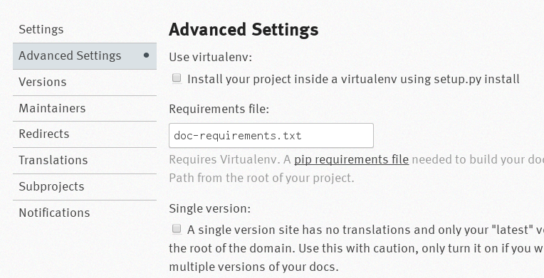

.. highlight:: rest

.. default-domain:: rst

Sphinx Showterm
###############

A Sphinx extension to embed termshows from `showterm.io
<https://showterm.io/>`_ into your `Sphinx <http://sphinx-doc.org/>`_
documentation.

The source for sphinxcontrib-showterm is hosted on GitHub:
`tbielawa/sphinxcontrib-showterm
<https://github.com/tbielawa/sphinxcontrib-showterm>`_

.. contents::
   :depth: 2
   :local:

Example
#######

Below is the example termshow from the showterm.io `homepage
<https://showterm.io/>`_. It is embedded in this document using the
:rst:dir:`showterm` extension:

.. showterm:: 7b5f8d42ba021511e627e

Installation
############

You will need to have the python module ``sphinxcontrib-showterm``
installed to use this extension. This is available via `PyPi
<https://pypi.python.org/pypi/sphinxcontrib-showterm/>`_::

    $ pip install sphinxcontrib-showterm

And inside of your ``conf.py`` file you will add
``'sphinxcontrib.showterm'`` to the ``extensions`` list:

.. code-block:: python
   :emphasize-lines: 3

   # Add any Sphinx extension module names here, as strings. They can be extensions
   # coming with Sphinx (named 'sphinx.ext.*') or your custom ones.
   extensions = ['sphinx.ext.autodoc', 'sphinxcontrib.showterm']

Are you using a site like `readthedocs <http://readthedocs.org/>`_ to
host your documentation? You will need to fill in a value for the
``Requirements file`` option under the **Admin** - **Advanced
Settings** menu. This file needs to list any modules you need ``pip``
installed prior to building your documentation.

For example, **this** docsite is `rather simple
<https://github.com/tbielawa/sphinxcontrib-showterm/blob/master/docsite/source/conf.py#L43>`_. It
only requires the :rst:dir:`showterm` extension to build the
documentation successfully. In *readthedocs* this project is
configured to use a file called `doc-requirements.txt
<https://github.com/tbielawa/sphinxcontrib-showterm/blob/master/doc-requirements.txt>`_. The
contents of which is displayed below:

.. literalinclude:: ../../doc-requirements.txt

Usage
#####

.. rst:directive:: .. showterm::

   The :rst:dir:`showterm` directive requires one argument:
   ``showterm_id``, the ID of your termshow.

   For example, *the example* termshow on the showterm.io homepage is
   ``7b5f8d42ba021511e627e``. We could embed it in a reST document
   like this::

      .. showterm:: 7b5f8d42ba021511e627e

   The showterm.io service can also be `ran privately
   <https://github.com/ConradIrwin/showterm.io>`_. If you're running
   your own showterm server you can set the showterm domain with the
   ``showtermurl`` flag option. For example, if your showterm domain
   were ``https://showterm.example.com``::

      .. showterm:: 7b5f8d42ba021511e627e
         :showtermurl: https://showterm.example.com

   .. note:: Trailing slashes in the ``showtermurl`` are
             insignificant. All URLs are normalized prior to document
             rendering.

   It's OK if we're not running the showterm service at the root
   location of our domain. We can include the location in the option
   argument too. For example, if our showterm service is running under
   ``https://utils.example.com/showterm/``::

      .. showterm:: 7b5f8d42ba021511e627e
         :showtermurl: https://utils.example.com/showterm/

   Limited control over the presentation of the termshow is enabled
   via the ``width`` and ``height`` flag options. The default values
   for these options are **640px** and **480px** respectively.

   Acceptable values for the ``width`` and ``height`` options are
   specified as either an exact pixel value (with the ``px`` unit), or
   as a percentage (with the ``%`` unit). Spaces count, so do not
   include them between the number and the unit:

   **Good:**

   * ``1337px``
   * ``33%``

   **Bad:**

   * ``100 px``
   * ``100``
   * ``100 %``

   Below is an example where we explicitly set the ``width`` and
   ``height`` parameters to *higher resolution* values::

      .. showterm:: 7b5f8d42ba021511e627e
         :width: 1080px
         :height: 720px

   The speed of the termshow can also be configured by using the
   ``speed`` option flag. Acceptable values include:

   * ``slow`` - *default* (equivalent to real-time speed)
   * ``fast`` - *2x the original speed*
   * ``stop`` - *stopped*

   Below is an example where we embed the termshow but do not run it
   yet. This termshow is stopped and awaiting the client to start it::

      .. showterm:: 7b5f8d42ba021511e627e
         :speed: stop

   Attempting to use any other value for the ``speed`` option will
   result in a compilation error like the following::

      $ make html
      sphinx-build -b html -d build/doctrees   source build/html
      Running Sphinx v1.1.3
      loading pickled environment... done
      building [html]: targets for 1 source files that are out of date
      ...
      /home/tbielawa/Projects/sphinxcontrib-showterm/docsite/source/index.rst:27: ERROR: Error in "showterm" directive:
      invalid option value: (option: "speed"; value: 'derp')
      "derp" unknown; choose from "slow", "fast", or "stop".

      .. showterm:: 7b5f8d42ba021511e627e
         :speed: derp
      /home/tbielawa/Projects/sphinxcontrib-showterm/docsite/source/index.rst:107: WARNING: Literal block expected; none found.

Configuration Settings (``conf.py``)
####################################

You can set termshow display default configuration parameters in your
``conf.py`` file. None of these settings need to be defined in your
``conf.py`` file explicitly. Below is a list of supported settings and
their defaults if not overridden.

.. list-table::
   :header-rows: 1

   * - Parameter
     - Description
     - Default
   * - ``showtermurl``
     - Base url to termshows. Change if you run your own showterm server
     - ``https://showterm.io``
   * - ``showtermwidth``
     - Default termshow width
     - ``640px``
   * - ``showtermheight``
     - Default termshow height
     - ``480px``
   * - ``showtermspeed``
     - Default termshow speed. Acceptable values are: ``slow``, ``fast``, and ``stop``.
     - ``stop``

Features Coming Soon
####################

Check out all open issues/RFEs on the GitHub issue tracker:
`tbielawa/sphinxcontrib-showterm
<https://github.com/tbielawa/sphinxcontrib-showterm/issues>`_

* `Support generated lists of termshows <https://github.com/tbielawa/sphinxcontrib-showterm/issues/3>`_
* `Support termshow title/captions <https://github.com/tbielawa/sphinxcontrib-showterm/issues/4>`_
